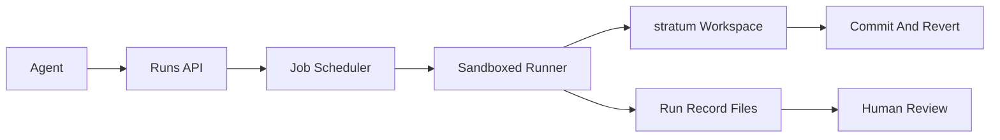

# Execution Roadmap

This guide describes the minimal architecture required to evolve `stratum` from an agent workspace into an execution layer.

## Goal

Move from:

- persistent workspaces

to:

- persistent workspaces plus safe, auditable command execution against those workspaces

## Product Principle

Execution should be attached to the workspace, not separate from it.

Every run should leave behind durable artifacts that humans and agents can inspect later.

## Phase 1: Run Records Without Full Sandbox

Before building a general-purpose runner, define a workspace-native run model.

### Run layout

Represent each run under a reserved directory:

```text
/runs/<run-id>/
├── prompt.md
├── command.md
├── stdout.md
├── stderr.md
├── result.md
├── metadata.md
└── artifacts/
```

### What each file stores

- `prompt.md`: the user request or agent goal
- `command.md`: the exact command or tool request being executed
- `stdout.md`: captured standard output
- `stderr.md`: captured standard error
- `result.md`: human-readable summary or final status
- `metadata.md`: run id, workspace id, agent id, agent username, created time, status, optional start time, optional end time, optional exit code, source commit

### Why this phase matters

- It makes execution auditable before the runner is complex.
- It aligns execution history with the core markdown-first product.
- It lets humans review runs in the same workspace they already trust.

### Phase 1 API

- `POST /runs`: create the durable run-record layout in a mounted workspace. This endpoint records supplied run data only; it does not execute commands, stream output, or manage job state. Phase 1 returns non-2xx on write failure, but does not guarantee multi-file atomicity.

Run creation records `queued` status by default unless the caller provides a specific status for imported or externally managed run data.

## Phase 2: Job Runner

Add a job system that can execute commands against a workspace.

### Current Phase 2 foundation

The first runner slice is implemented as a disabled-by-default, provider-free local foundation. It exposes `/execute` routes only when `STRATUM_EXECUTION_RUNNER=process-local` and `STRATUM_EXECUTION_ENABLE_DEV=1` are set. Default local startup keeps execution unavailable, and durable-cloud returns the stable unsupported response for `/execute` and `/execute/{*path}`.

The local runner:

- creates a queued `/runs/<run-id>/` record before job submission
- executes one shell command through the process-local runner
- captures bounded stdout and stderr
- updates metadata to `running`, then to `succeeded`, `failed`, `cancelled`, or `timed_out`
- supports workspace-scoped job list/get/wait/cancel
- omits raw command, prompt, output, environment, temp paths, provider errors, tokens, and backing workspace paths from public execution responses and audit details

It does not provide production sandboxing, distributed scheduling, durable job recovery after process crash, CPU or memory limits, package installation policy, broad network policy, SDK releases, hosted UI, semantic search, or production event-bus broker adapters.

### Responsibilities

- create a run record
- stage a workspace snapshot or working copy
- run a command
- stream or capture output
- write outputs back into `/runs/<run-id>/`
- update final status

### Minimal API

- `POST /execute`
- `GET /execute/jobs`
- `GET /execute/jobs/{job_id}`
- `POST /execute/jobs/{job_id}/wait`
- `POST /execute/jobs/{job_id}/cancel`
- `GET /runs/{id}`
- `GET /runs/{id}/stdout`
- `GET /runs/{id}/stderr`

### Suggested states

- `queued`
- `running`
- `succeeded`
- `failed`
- `cancelled`
- `timed_out`

## Phase 3: Sandbox Policy

Once execution exists, control becomes the product.

### Required controls

- command timeout
- output size caps
- memory and CPU limits
- environment variable allowlist
- working-directory scoping
- optional network policy
- artifact size limits

### Policy model

Policies should be attached to:

- workspace
- agent identity
- run type

That allows different controls for a read-only search agent versus a code-generating agent.

## Phase 4: Output Capture And Review

Captured output should not just be raw bytes.

### Needed features

- streaming output for live demos and operator confidence
- persisted output for later inspection
- summarized result file for fast review
- optional commit or snapshot after successful run

### Human review flow

1. Agent runs a command.
2. Output lands in `/runs/<run-id>/`.
3. Human reviews `result.md` and diff/status output.
4. Human accepts, rejects, or reverts the resulting workspace state.

## Recommended Architecture



## Suggested Build Order

### Step 1

Create the run-record file model and reserve `/runs/`.

### Step 2

Add job metadata, status transitions, and result persistence.

### Step 3

Build a minimal runner with:

- one command
- one workspace
- timeout
- stdout/stderr capture

### Step 4

Add policy controls and cancellation.

### Step 5

Add optional auto-commit, branch/snapshot support, and provenance links to commits.

## Non-Goals For The First Execution Release

Avoid these in the first execution version:

- distributed scheduling
- arbitrary package installation
- broad outbound network access by default
- multi-step workflow orchestration
- multi-language SDK parity on day one

The first execution release should be narrow, safe, and reviewable.

## Success Criteria

The execution layer is ready when:

- every run produces durable workspace artifacts
- humans can explain what happened by reading the workspace
- failures are preserved, not hidden
- agent actions can be reviewed and reverted like file edits
